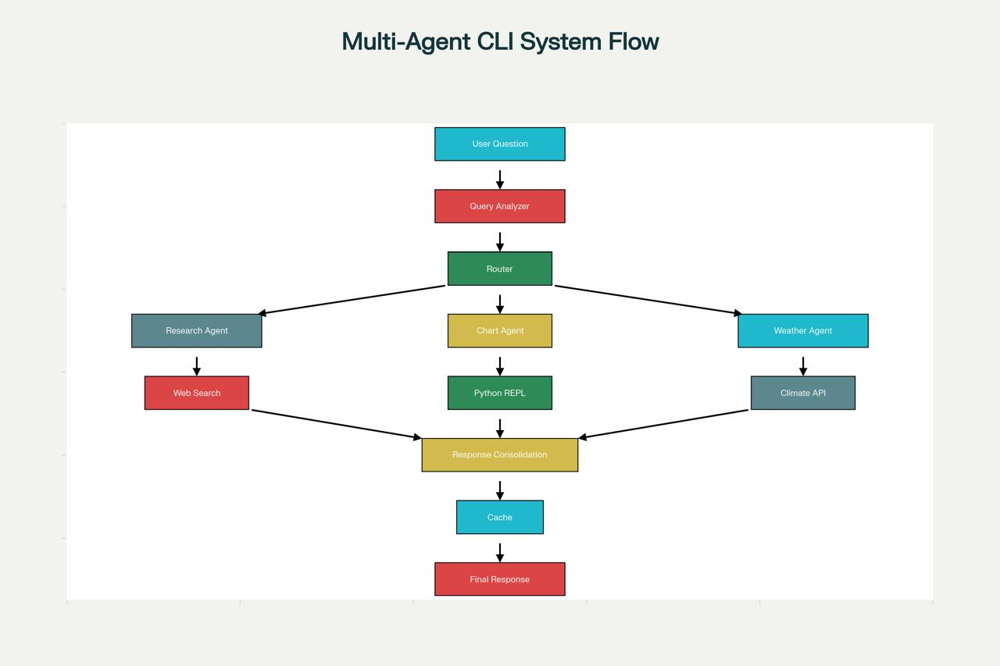

# Sistema Multi-Agente CLI - Economia Brasileira

Sistema inteligente de linha de comando com múltiplos agentes especializados para análise econômica, geração de gráficos e consultas climáticas sobre o Brasil.



## 📋 Descrição

Sistema multi-agente desenvolvido em Python que processa consultas sobre economia brasileira através de agentes especializados que colaboram entre si. O sistema utiliza LangChain e modelos de linguagem (LLMs) para análise inteligente de consultas e roteamento automático para o agente mais adequado.

## ✨ Características Principais

- **🤖 Arquitetura Multi-Agente**: 3 agentes especializados trabalhando de forma coordenada
- **🔍 Agente de Pesquisa**: Busca dados econômicos do IBGE e Banco Central
- **📊 Agente de Gráficos**: Cria visualizações com Python/Matplotlib
- **🌤️ Agente Climático**: Consulta informações meteorológicas
- **🎯 Roteamento Inteligente**: Análise automática da intenção do usuário
- **⚡ Sistema de Cache**: Otimização de consultas repetidas
- **⏱️ Controle de Timeout**: Execução com timeout configurável (30s)

## 🏗️ Fluxo do Sistema

1. **User Question** → Usuário faz uma pergunta
2. **Query Analyzer** → Sistema analisa a intenção da consulta
3. **Router** → Roteia para o agente especializado apropriado
4. **Agent Execution**:
   - **Research Agent** → Busca web (DuckDuckGo, IBGE, BCB)
   - **Chart Agent** → Execução Python/REPL para gráficos
   - **Weather Agent** → Consulta APIs climáticas
5. **Response Consolidation** → Resultados são consolidados
6. **Cache** → Resposta é armazenada em cache
7. **Final Response** → Retorno ao usuário

## 🚀 Instalação

### Pré-requisitos

- Python 3.8+
- Pip (gerenciador de pacotes Python)
- Token de API (GitHub Models ou OpenAI)

### Passos de Instalação

```bash
# 1. Clone o repositório (ou baixe os arquivos)
git clone <seu-repositorio>
cd sistema-multi-agente

# 2. Instale as dependências
pip install -r requirements.txt

# 3. Configure as variáveis de ambiente
# Crie um arquivo .env na raiz do projeto
echo "GITHUB_TOKEN=seu_token_aqui" > .env

# Ou exporte diretamente (Linux/Mac)
export GITHUB_TOKEN=seu_token_aqui

# Ou no Windows
set GITHUB_TOKEN=seu_token_aqui
```

## 📦 Dependências

Principais bibliotecas utilizadas:

- **langchain** (>= 0.3.25): Framework para LLMs
- **langchain-openai** (>= 0.3.35): Integração com modelos OpenAI
- **langgraph** (>= 1.0.1): Orquestração de grafos de agentes
- **duckduckgo-search** (>= 6.4.0): Busca web
- **matplotlib** (>= 3.8.0): Visualização de dados
- **pandas** (>= 2.1.0): Análise de dados
- **python-dotenv** (>= 1.0.1): Gerenciamento de variáveis de ambiente

Veja o arquivo `requirements.txt` para a lista completa.

## 💻 Uso

### Iniciar o Sistema

```bash
python main.py
```

### Exemplos de Consultas

**Pesquisa Econômica:**
```
🔮 Você: PIB Brasil 2023
🔮 Você: População São Paulo
🔮 Você: Economia Minas Gerais
```

**Gráficos:**
```
🔮 Você: Gráfico PIB últimos 5 anos
🔮 Você: Visualizar crescimento econômico
```

**Clima:**
```
🔮 Você: Temperatura São Paulo
🔮 Você: Clima Brasília hoje
```

### Comandos Especiais

- `help` ou `ajuda` - Mostra menu de ajuda
- `status` ou `info` - Status do sistema
- `cache clear` - Limpa cache do sistema
- `cache info` - Informações do cache
- `clear` ou `limpar` - Limpa a tela
- `quit`, `exit` ou `sair` - Sair do sistema

## 📁 Estrutura do Projeto

```
├── main.py              # Script principal e interface CLI
├── tools.py             # Ferramentas dos agentes (busca, Python REPL, APIs)
├── prompts.py           # Prompts otimizados para cada agente
├── utils.py             # Utilitários (cache, análise, validação)
├── test_system.py       # Testes unitários e de integração
├── requirements.txt     # Dependências do projeto
└── README.md            # Este arquivo
```

### Descrição dos Módulos

**main.py**
- Sistema multi-agente principal
- Interface CLI interativa
- Gerenciamento de timeout e execução

**tools.py**
- `web_search_tool`: Busca web com DuckDuckGo
- `python_repl_tool`: Execução de código Python
- `ibge_data_tool`: Acesso à API do IBGE
- `bcb_data_tool`: Acesso à API do Banco Central

**prompts.py**
- Prompts especializados para cada agente
- Instruções de roteamento
- Templates otimizados

**utils.py**
- `QueryAnalyzer`: Análise inteligente de consultas
- `CacheManager`: Sistema de cache
- `DataValidator`: Validação de dados
- `ResponseFormatter`: Formatação de respostas

## ⚙️ Configuração

### Variáveis de Ambiente

Crie um arquivo `.env` com as seguintes variáveis:

```env
# Token de API (obrigatório)
GITHUB_TOKEN=seu_github_token
# OU
OPENAI_API_KEY=sua_openai_key

# Configurações opcionais (valores padrão)
AGENT_TIMEOUT=30        # Timeout em segundos
MAX_ITERATIONS=20       # Máximo de iterações por agente
REQUEST_TIMEOUT=10      # Timeout para requests HTTP
```

### Obtendo Token de API

**GitHub Models** (Recomendado):
1. Acesse [github.com/settings/tokens](https://github.com/settings/tokens)
2. Gere um Personal Access Token
3. Use como `GITHUB_TOKEN`

**OpenAI**:
1. Acesse [platform.openai.com](https://platform.openai.com/)
2. Crie uma API Key
3. Use como `OPENAI_API_KEY`

## 🧪 Testes

Execute os testes unitários:

```bash
# Todos os testes
pytest test_system.py -v

# Testes específicos
pytest test_system.py::TestBrazilianEconomyAgentSystem -v

# Com cobertura
pytest test_system.py --cov=. --cov-report=html
```

## 🔧 Solução de Problemas

### Erro: "Token de API não configurado"
**Solução**: Verifique se o arquivo `.env` existe e contém `GITHUB_TOKEN` ou `OPENAI_API_KEY`.

### Erro: "Module not found"
**Solução**: Instale as dependências com `pip install -r requirements.txt`

### Timeout nas consultas
**Solução**: Consultas complexas podem exceder o timeout. Tente:
- Fazer perguntas mais específicas
- Aumentar `AGENT_TIMEOUT` no `.env`
- Verificar conexão com internet

### Erro de busca web
**Solução**: O DuckDuckGo pode ter limitações de rate. Aguarde alguns segundos e tente novamente.

## 🎯 Performance

- **Timeout por agente**: 30 segundos (configurável)
- **Máximo de iterações**: 20 por consulta
- **Cache**: 30 minutos de TTL
- **Request timeout**: 10 segundos

## 📝 Licença

Este projeto é fornecido como está, para fins educacionais e de pesquisa.

## 🤝 Contribuições

Sugestões e melhorias são bem-vindas! Para contribuir:

1. Faça um fork do projeto
2. Crie uma branch para sua feature (`git checkout -b feature/MinhaFeature`)
3. Commit suas mudanças (`git commit -m 'Adiciona MinhaFeature'`)
4. Push para a branch (`git push origin feature/MinhaFeature`)
5. Abra um Pull Request

